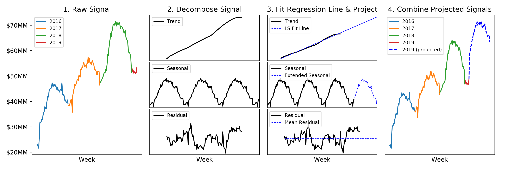

# Time Series Forecasting
We built this repository to help retailers prepare for, and evaluate the impact of, the COVID-19 epidemic. This repository can be used to forecast future timeseries values, and compare these forecasts against observed values to measure the impact-to-date of fleet-wide influences. For more detail on the motivation behind this project, please see https://marketdial.com/covid-19-model/.

The repository consists of python scripts that utilize various methods of forecasting, and a generic excel model that can be used to track and estimate effects at the store, department, and state level.

## 1. Code Usage
The forecast algorithm uses an input CSV in which each row represents the total sales for a given store, on a particular day, at a specified hierarchy level (Grocery/Infant etc.). The CSV must contain five columns: hierarchy_id, store_id, date_day, metric (revenue/traffic count etc.), value. The date_day must be in YYYY-MM-DD format. The *sample_input_data.csv* illustrates the expected input data format. Along with the input data, the user will specify the year they want to make projections for. 

The forecast algorithm will iterate through every store-category pair, make individual weekly projections, and join all the data into a data frame that is saved into the Output folder. The data frame has four index columns: hierarchy, store_id, year, week, and an additional projected column for each metric column in the input file. An example output is given in *Output/2019_projected.csv*.

### 1.1 File descriptions and order of execution.
The first file to be executed is run_forecasts.py. This file will read data from a pre-defined location and, using the forecasting functions it imports from forecasts_methods.py, save two files containing the real and projected metric values into the Output folder. 

Before running the projections for your year of interest, we recommend running the projections for the same time last year to gauge the model's performance on your data. Once *run_forecasts.py* has been run with last year's data, you can run *evaluate_model_errors.py* which will output a CSV containing the model errors for each hierarchy. These errors are at the total fleet-level (i.e. the prediction errors for any individual store will be higher than for the total fleet).

You can then optionally run plot_all_forecasts.py which will read the output from run_forecasts.py, iterate through each hierarchy, aggregate the data across all stores, and save plots of the real vs. projected values into the Output folder. An example output:


### 1.2 File parameters.
There are only a few parameters that need to be adjusted within with each script to get started. 

For run_forecasts.py, the user must set:
```
year_start: the year the user wants to make projections for.
week_start: the week where the projections should start (i.e. a value of 10 means that you want to use the first 9 weeks of the year as part of the training data).
method: selects which of three methods should be used to make the projections. A description of each method is given below.
input_file: file location of the input data.
```

And for plot_all_forecasts.py, the user only needs to set:
```
year_start: same value that was used in run_forecasts.py
week_start: "                                          "
plot_metric: the metric to be plotted.
```


## 2. Methodology Review
### 2.1. Signal-Trend Decomposition and LS Regression
This method works by using pythons built-in decomposition algorithm to split the signal into its trend and seasonal components and then forecasting the components individually. 

The trend is extracted from the signal by computing a running mean with length equal to the expected seasonality (is this case we use a 52-week running average). Once the trend is removed from the original signal, the seasonal component is removed using a convolution filter. What remains after extracting the trend and seasonal components is the raw residuals.

We project future values for the trend using weighted linear regression (we weight the more recent data higher). The seasonal component is projected repetitively. And the residual component is projected using its mean. Finally, the individual components are added back together for our projection of the original signal.



### 2.2. Signal-Trend Decomposition with ARIMA Model
To make predictions with an ARIMA model, the data must be stationary after differencing with the order specified in the model. This means that ARIMA cannot natively handle seasonal data. While there are many methods for removing the seasonality (including simple differences), we again use pythons built-in function. Similar to the prior method, we make projections on the individual components and then add them together.

Alternatively, we could use a SARIMA model which models the seasonal component concurrently with the elements of the ARIMA model. However, a general-purpose SARIMA model has multiple parameters that must be carefully tuned. This generally requires looking at partial autocorrelation plots and making judgment call's on the degree of the model. To make this method more generalizable, we stick with our simpler implementation of ARIMA.


### 2.3. Simple Lagged Yearly Comp Method

The last projection model we implemented is the simplest and performed the best across a variety of data. This method works iteratively. It projects the next value in a sequence by computing the average yearly change of the most recent 20 weeks, and adding this average to the value observed one year ago. The method is essentially a lagged version of the signal added to a running average of itself. The *run_forecasts.py* script defaults to this method. While there are certainly more advanced methodologies available, similar to SARIMA, they generally require advanced tuning specific to each data set.


## 3. Spreadsheet Scenario Planning
This spreadsheet tabs are colored by their purpose: (1) outputs = green (2) scenario-planning adjustable fields = orange (3) input data = blue.

### 3.1. Add Data
To use this spreadsheet, you will need prediction and actual data on the store-category-week level as produced from the above Python model (run_forecasts.py). Data can be copy and pasted into the "PASTE HERE Actuals" and "PASTE HERE Projections" tabs. Columns for store, week, year, category, metric, and values should retain the same ordering as the example spreadsheet.

Store-region information can be added to the "Store to Region" tab.

### 3.2. Adjust Other Fields as Necessary
There are a few fields which will need to be manually-adjusted based on your data. Several tabs will need to reflect the product categories of your input data ("SCENARIO category week", "Actual (Ac)", "Scenario (Sc)", etc.). The "SCENARIO region" tab should reflect the regions of your stores as laid out in the "Store to Region" tab. All necessary changes are marked with a cell comment in the spreadsheet (red triangle in top-right corner of the cell).

### 3.3. Scenario Planning
The "SCENARIO metric" tab allows a user to select the metric desired for the analysis (e.g., revenue, traffic, units sold).

The "SCENARIO category week" tab allows the user to adjust hypothesized percent increase or decrease from predicted values at the category-week level.

The "SCENARIO region" tab allows a user to suppose that certain regional effects will be greater than others.

### 3.4. Outputs
The "Actuals (Ac)" tab reflects the to-date actual volume across all stores.

The "Scenario (Sc)" tab reflects the scenario volume by category and week, calcualted based on your inputs.

The "Projections (Pr)" tab reflects the model's volume projections by category and week.

The "Actual Impact (Ac-Pr)" tab reflects the actual impact, which is the net of actuals to projections (ie, how much we are above/below projection to date).

The "Scenario Impact (Sc-Pr)" tab reflects the scenario impact by category week based on user impacts (ie, how much the scenario is above/below the projections).

The "CHART Impact" tab reflects some visualizations of the prior tabs. Specifically, you can view the Trend and Impact (actual, projected, scenario). You can adjust if you want to view these carts by category or for "All Products" in cell K2.
